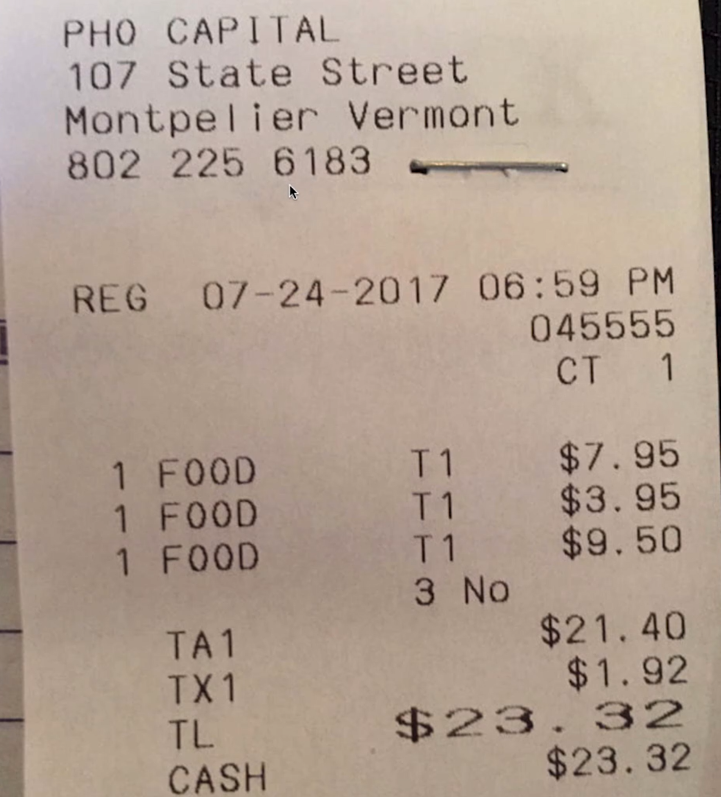
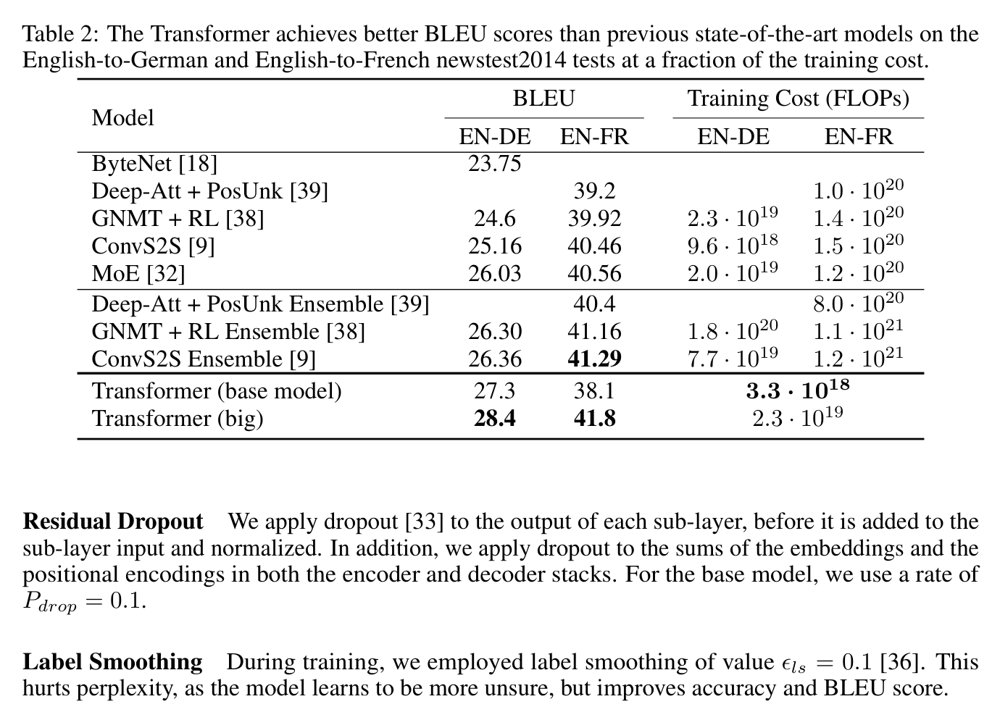
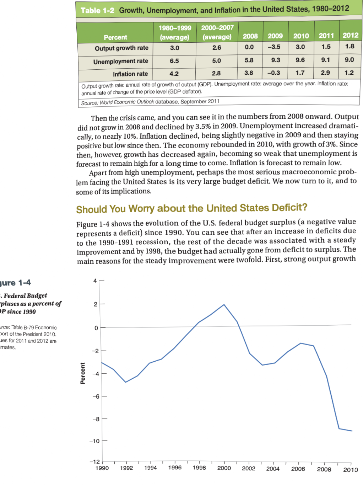
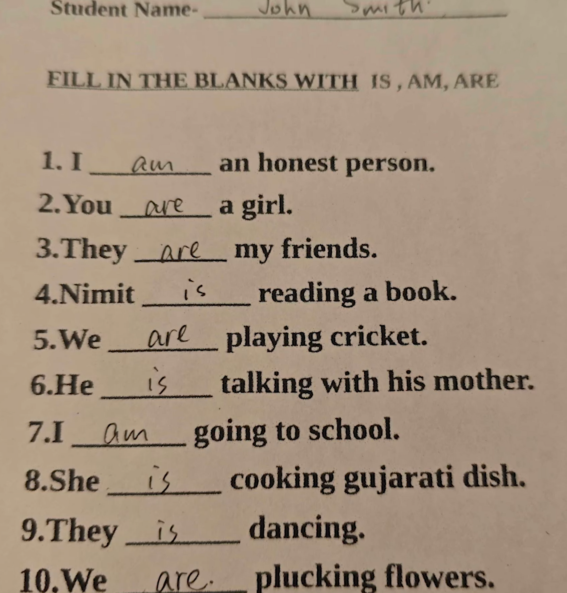
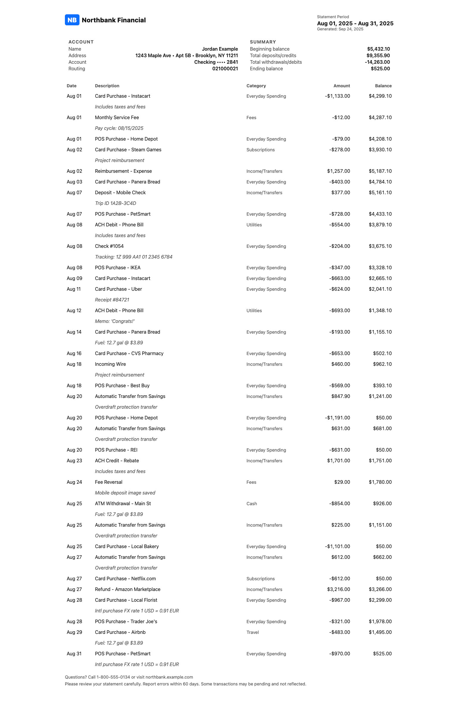

# 📄 Document Processing with PaddleOCR

> Intelligent document understanding using PaddleOCR — combining text detection, text recognition, layout analysis, and LLM-powered reasoning into a unified pipeline.

> **📚 Based on:** [Document AI: From OCR to Agentic Doc Extraction](https://learn.deeplearning.ai/courses/document-ai-from-ocr-to-agentic-doc-extraction) — a free course by [DeepLearning.AI](https://www.deeplearning.ai/), built in partnership with [LandingAI](https://landing.ai/). The notebook code and structure are adapted from **Lab 2: Document Processing with PaddleOCR**. This repo adds a reorganized project structure, extended documentation, and sample images for standalone use outside the course platform.

[](https://www.python.org/)
[](https://github.com/PaddlePaddle/PaddleOCR)
[](https://www.langchain.com/)
[](https://openai.com/)
[](LICENSE)

---

## 🔍 Overview

This project explores **end-to-end document processing** using PaddleOCR's latest models (PP-OCRv5, PP-DocLayout+) combined with a LangChain agent backed by an OpenAI LLM. The notebook walks through progressively more complex document types — from simple receipts to multi-column academic articles — exposing both the strengths and limitations of OCR-only approaches, then shows how layout detection solves them.

### What's covered

| Topic                       | Description                                              |
| --------------------------- | -------------------------------------------------------- |
| **OCR Basics**              | Text detection + recognition on real-world images        |
| **LangChain Agent**         | Wrapping PaddleOCR as a tool for LLM-driven document Q&A |
| **Receipt Processing**      | Extract line items, tax, and verify totals               |
| **Table Extraction**        | Parse structured data from academic papers               |
| **Handwriting Recognition** | Read student fill-in-the-blank worksheets                |
| **OCR Limitations**         | Charts, multi-column layouts — where OCR alone fails     |
| **Layout Detection**        | Region-aware parsing using PP-DocLayout+                 |
| **Complex Documents**       | Bank statements with nested tables and fine print        |

---

## 🖼️ Sample Results

<table>
  <tr>
    <td align="center"><b>Receipt OCR</b></td>
    <td align="center"><b>Table Extraction</b></td>
    <td align="center"><b>Layout Detection</b></td>
  </tr>
  <tr>
    <td></td>
    <td></td>
    <td></td>
  </tr>
  <tr>
    <td></td>
    <td></td>
    <td></td>
  </tr>
</table>

---

## 🏗️ Architecture

```
Input Image
    │
    ▼
┌─────────────────────────────────┐
│       PaddleOCR Pipeline        │
│                                 │
│  Doc Preprocessor               │
│  ├── Orientation Classification │
│  └── Document Unwarping         │
│                                 │
│  Text Detection (PP-OCRv5-DET)  │
│  └── Locates text bounding boxes│
│                                 │
│  Text Recognition (PP-OCRv5-REC)│
│  └── Decodes character sequences│
└──────────────┬──────────────────┘
               │  texts, scores, bboxes
               ▼
┌─────────────────────────────────┐
│       LangChain Agent           │
│                                 │
│  OCR Tool → LLM Reasoning       │
│  └── GPT-4o-mini interprets,    │
│      validates, and structures  │
│      extracted content          │
└──────────────┬──────────────────┘
               │
               ▼
         Structured Output
         (JSON / verified facts)

── Layout-Aware Path ──────────────
Input Image → PP-DocLayout+
    └── Identifies: text, table,
        chart, title, footer, etc.
    └── Per-region OCR preserves
        column order and structure
```

---

## ⚡ Quickstart

### 1. Clone the repository

```bash
git clone https://github.com/nelsonrgonzalez/document-processing-paddleocr.git
cd document-processing-paddleocr
```

### 2. Create and activate a virtual environment

```bash
python -m venv venv
# Windows
venv\Scripts\activate
# macOS / Linux
source venv/bin/activate
```

### 3. Install dependencies

**CPU (recommended for first-time setup):**

```bash
pip install paddlepaddle
pip install "paddleocr[all]"
pip install -r requirements.txt
```

**GPU (CUDA 12.6):**

```bash
pip install paddlepaddle-gpu==3.0.0 -i https://www.paddlepaddle.org.cn/packages/stable/cu126/
pip install "paddleocr[all]"
pip install -r requirements.txt
```

### 4. Configure environment variables

```bash
cp .env.example .env
# Edit .env and add your OpenAI API key
```

### 5. Launch the notebook

```bash
jupyter notebook Document_Processing_with_PaddleOCR.ipynb
```

---

## 📦 Requirements

See [`requirements.txt`](requirements.txt) for the full list. Key dependencies:

| Package                             | Purpose                          |
| ----------------------------------- | -------------------------------- |
| `paddlepaddle` / `paddlepaddle-gpu` | Deep learning framework          |
| `paddleocr[all]`                    | OCR models + layout detection    |
| `langchain`, `langchain-openai`     | Agent framework                  |
| `opencv-contrib-python`             | Image processing & visualization |
| `pillow`                            | Image loading                    |
| `numpy`, `matplotlib`               | Arrays & plotting                |
| `python-dotenv`                     | Environment variable management  |

---

## 📂 Repository Structure

```
document-processing-paddleocr/
│
├── Document_Processing_with_PaddleOCR.ipynb   # Main notebook
│
├── images/
│   ├── samples/                               # Input test images
│   │   ├── receipt.png                        # Restaurant receipt
│   │   ├── attention_table_2.png              # ML paper table
│   │   ├── fill_in_the_blanks.png             # Handwritten worksheet
│   │   ├── report.png                         # Economic report w/ chart
│   │   ├── article.jpg                        # Multi-column article
│   │   └── bank_statement.png                 # Bank statement
│   │
│   └── outputs/                               # OCR-annotated results
│       ├── attention_table_2_output.png
│       ├── fill_in_the_blanks_output.png
│       ├── report_output.png
│       └── article_output.jpg
│
├── requirements.txt
├── .env.example
├── .gitignore
└── README.md
```

---

## 🔬 Key Findings

### ✅ Where PaddleOCR excels

- **Receipts and invoices** — near-perfect extraction with confidence scores >0.99
- **Printed tables** — correctly reads scientific notation (e.g. `2.3 · 10¹⁹`)
- **Handwriting** — handles cursive fill-in-the-blank with strong accuracy
- **Document preprocessing** — automatic deskewing, rotation correction, and noise removal

### ⚠️ Known limitations (and how layout detection helps)

| Problem               | Root Cause                                   | Solution                                                 |
| --------------------- | -------------------------------------------- | -------------------------------------------------------- |
| Charts misread        | OCR sees axis labels without spatial context | Layout detection classifies the entire chart as a region |
| Multi-column garbling | OCR reads horizontally across columns        | Layout detection preserves column boundaries before OCR  |
| Dense tables          | Overlapping bounding boxes                   | Per-region OCR after layout segmentation                 |

### 🤖 LLM reasoning adds value beyond raw OCR

The LangChain agent demonstrates that an LLM can:

- Correct scientific notation (`1020` → `10²⁰`) from context
- Identify missing data (blank cells vs. zero values)
- Verify arithmetic (receipt total = items + tax)
- Output structured JSON from unstructured OCR text

---

## 🗒️ Notebook Walkthrough

| Section                           | What you'll learn                                                                      |
| --------------------------------- | -------------------------------------------------------------------------------------- |
| **1. PaddleOCR Basics**           | Initialize models, run `ocr.predict()`, inspect `rec_texts`, `rec_scores`, `rec_polys` |
| **2. OCR Tool + LangChain Agent** | Wrap OCR as a `@tool`, build an `AgentExecutor`, run document Q&A                      |
| **3. Receipt Processing**         | Agent verifies the total is arithmetically correct                                     |
| **4. Table Extraction**           | Agent extracts FLOPs from a research paper table with correct scientific notation      |
| **5. Handwriting Recognition**    | Agent outputs student answers as structured JSON                                       |
| **6. OCR Limitations**            | Demonstrates failure modes on charts and multi-column layouts                          |
| **7. Layout Detection**           | `LayoutDetection` pipeline segments documents into typed regions                       |
| **8. Complex Layouts**            | Layout detection on a full bank statement                                              |

---

## 📜 License

This project is licensed under the MIT License — see the [LICENSE](LICENSE) file for details.

---

## 🙏 Acknowledgements

The code and notebook structure in this repository are adapted from **Lab 2: Document Processing with PaddleOCR** of the free course:

> **[Document AI: From OCR to Agentic Doc Extraction](https://learn.deeplearning.ai/courses/document-ai-from-ocr-to-agentic-doc-extraction)**
> by [DeepLearning.AI](https://www.deeplearning.ai/), built in partnership with [LandingAI](https://landing.ai/)
> Instructors: **David Park** (Sr. Director of Applied AI) and **Andrea Kropp** (Applied AI Engineer) — LandingAI

The course is free and highly recommended — it covers the full journey from traditional OCR to agentic document extraction pipelines with LandingAI's ADE tool.

Additional thanks to:

- [PaddleOCR](https://github.com/PaddlePaddle/PaddleOCR) by Baidu — for PP-OCRv5 and PP-DocLayout+
- [LangChain](https://github.com/langchain-ai/langchain) — for the agent framework
- [OpenAI](https://openai.com/) — for GPT-4o-mini reasoning
